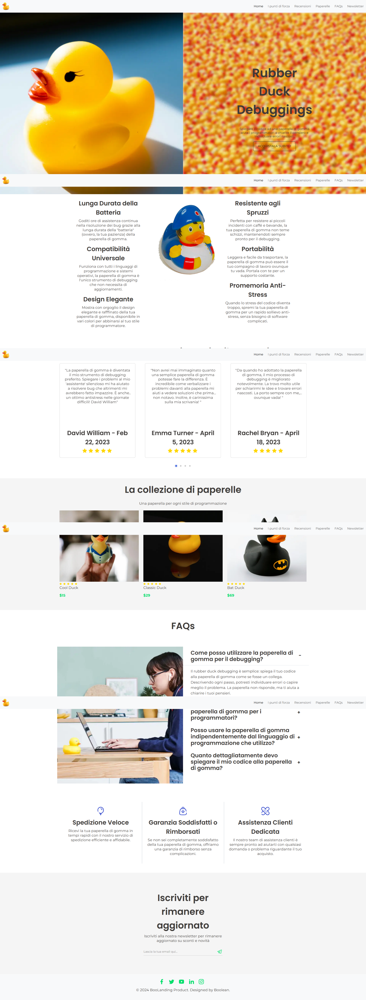

# 🦆 Rubber Duck Debugging - Landing Page

> Una landing page per promuovere il prodotto "Rubber Duck Debuggings" - Il miglior compagno per il debug del codice.

**Progetto realizzato per:** Boolean Academy  
**Tecnologie:** HTML5, CSS3, Bootstrap 5, JavaScript, Swiper  
**Approccio:** Mobile-first, Progressive Enhancement

---

## 📋 Indice

- [Anteprima](#-anteprima)
- [Scelte Tecniche](#-scelte-tecniche)
- [Struttura Progetto](#-struttura-progetto)
- [Features Implementate](#-features-implementate)
- [Criticità Risolte](#-criticità-risolte)
- [Performance & Ottimizzazioni](#-performance--ottimizzazioni)
- [Come Lanciare](#-come-lanciare)
- [Browser Support](#-browser-support)
- [Crediti](#-crediti)
- [Licenza](#-licenza)
- [Contatti](#-contatti)

---

## 🎨 Anteprima



**🔗 Demo Live:** [https://landingpageboolean.netlify.app/](https://landingpageboolean.netlify.app/)

**📊 Lighthouse Report:** Disponibile in `lighthouse-report.html`

---

## 🛠️ Scelte Tecniche

### Framework & Librerie

#### Bootstrap 5.3.2
**Perché:** Sistema di grid responsive maturo, componenti UI pronti all'uso (navbar, offcanvas, accordion), riduce drasticamente il tempo di sviluppo mantenendo consistenza cross-browser.

**Componenti utilizzati:**
- Grid system (container/row/col-*)
- Navbar + Offcanvas (menu mobile)
- Accordion (sezione FAQs)
- ChatGpt (per il readme)

#### Swiper 12
**Perché:** Libreria leader per slider touch-friendly, supporto nativo per breakpoints responsive, performance ottimizzate per mobile.

**Implementazione avanzata:** Caricamento dinamico con progressive enhancement (vedi sezione criticità).

#### Google Fonts (Montserrat + Poppins)
**Perché:** Tipografia professionale, `preconnect` per ridurre latenza DNS, weights selezionati (400, 600, 700) per bilanciare leggibilità e peso totale.

---

### Approccio Architetturale

#### Mobile-First
Tutti gli stili CSS partono dalla versione mobile (320px) e scalano verso desktop con media queries progressive:
```css
/* Base: Mobile */
h1 { font-size: 2rem; }

/* Tablet */
@media (min-width: 768px) { h1 { font-size: 3rem; } }

/* Desktop */
@media (min-width: 992px) { h1 { font-size: 4rem; } }
```

#### Progressive Enhancement
**Swiper dinamico:** Lo slider carica la libreria solo quando necessario, con fallback statico se JavaScript è disabilitato o il caricamento fallisce.

**Vantaggi:**
- Contenuto visibile immediatamente (no buco vuoto)
- Riduzione blocking scripts nel critical rendering path
- Graceful degradation

---

### Ottimizzazioni Immagini

#### WebP Format
**Tutte le immagini convertite da PNG a WebP:**
- `logo.png` → `logo.webp` (~60% peso ridotto)
- `banner-image.png` → `banner-image.webp`
- `product-item*.png` → `product-item*.webp`

**Benefici:** Caricamento più veloce, bandwidth ridotta, migliore UX su connessioni lente.

#### Width/Height Attributes
**Attributi HTML per prevenire CLS (Cumulative Layout Shift):**
```html

```
Il browser riserva lo spazio prima che l'immagine carichi → zero layout shift.

---

### CSS Architecture

#### CSS Custom Properties (Variables)
**Centralizzazione colori e valori:**
```css
:root {
  --primary-color: #2E45CC;
  --secondary-color: #04DF6C;
  --text-color: #3D3A38;
  --focus-background: #f5f5f5;
}
```

**Benefici:** Manutenibilità, facilità di theming, consistenza visiva.

#### Normalize.css
**Reset CSS professionale** caricato per primo per garantire rendering consistente cross-browser.

---

## 📁 Struttura Progetto

```
landing-page-product/
├── index.html              # Pagina principale
├── README.md               # Documentazione
├── .gitignore              # File esclusi da Git
├── lighthouse-report.html  # Report performance Lighthouse
├── full-page-screenshot.png # Screenshot completo pagina
│
├── css/
│   ├── normalize.css       # CSS reset
│   ├── style.css           # Stili custom principali
│   └── swiper.css          # Personalizzazioni Swiper
│
├── js/
│   ├── main.js             # Logica menu mobile
│   ├── swiper.js           # Configurazione Swiper
│   └── swiper-loader.js    # Caricamento dinamico
│
├── img/                    # Immagini ottimizzate (WebP)
│   ├── logo.webp
│   ├── banner-image.webp
│   ├── banner-bg.webp
│   └── product-item*.webp
│
├── assets/
│   └── icons.svg           # Sprite SVG con tutte le icone
│
└── favicon files           # Icon set per dispositivi
```

---

## ✨ Features Implementate

### ✅ Core Features (Obbligatori)

- [x] **Layout responsive** (mobile + tablet + desktop)
- [x] **Menu mobile** con offcanvas laterale
- [x] **Slider recensioni** con Swiper (1/2/3 slide per breakpoint)
- [x] **Accordion FAQs** con icone + e - personalizzate
- [x] **Form newsletter** con label accessibile
- [x] **SVG sprite system** per icone scalabili
- [x] **Semantic HTML5** (nav, header, main, footer, section)

### 🌟 Features Bonus

- [x] **Progressive enhancement** con caricamento Swiper dinamico
- [x] **Immagini WebP** per performance ottimali
- [x] **CSS Variables** per architettura manutenibile
- [x] **Smooth scroll** con chiusura menu mobile
- [x] **Focus outline** personalizzato per accessibilità
- [x] **Width/height** su immagini critiche (anti-CLS)
- [x] **Deploy su Netlify** con CI/CD automatico

---

## 🐛 Criticità Risolte

### 1. Race Condition Menu Mobile
**Problema:** Click su link menu mobile → menu chiude ma scroll avviene prima della chiusura animazione → scatta nel punto sbagliato.

**Soluzione:** Evento `hidden.bs.offcanvas` per attendere chiusura completa prima dello scroll:
```javascript
offcanvasInstance.hide();
navOffcanvas.addEventListener('hidden.bs.offcanvas', function onHidden() {
    targetElement.scrollIntoView({ behavior: 'smooth' });
    navOffcanvas.removeEventListener('hidden.bs.offcanvas', onHidden);
});
```

**Lesson learned:** Eventi asincroni UI richiedono gestione timing esplicita.

---

### 2. Promise Chaining in Swiper Loader
**Problema:** `loadStylesheet()` chiamata ma non aspettata → `initSwiper()` parte prima che CSS sia caricato → FOUC (Flash Of Unstyled Content).

**Soluzione:** `return` nella Promise per concatenamento corretto:
```javascript
loadScript('swiper.js')
  .then(() => {
      return loadStylesheet('swiper.css'); // ← RETURN chiave
  })
  .then(() => {
      initSwiper(); // Parte DOPO che CSS è caricato
  });
```

**Lesson learned:** Promise chaining richiede `return` esplicito per aspettare Promise interne.

---

### 3. Layout Shift Immagini
**Problema:** Immagini caricano dopo → layout "salta" quando arrivano → penalità CLS su Lighthouse.

**Soluzione:** Attributi `width` e `height` nell'HTML:
```html

```
Il browser calcola aspect ratio e riserva spazio PRIMA del caricamento CSS.

**Lesson learned:** Attributi HTML > CSS per prevenire layout shift.

---

### 4. Footer Specificity CSS
**Problema:** Selettore lungo con `!important` per sovrascrivere Bootstrap:
```css
footer.bg-body-tertiary.text-center.py-4.m-0.focus-background {
    background-color: var(--focus-background) !important;
}
```

**Soluzione:** Classe custom singola:
```html
<footer class="duck-footer-custom ...">
```
```css
.duck-footer-custom {
    background-color: var(--background-color);
}
```

**Lesson learned:** Classi custom > specificity wars con framework CSS.

---

## ⚡ Performance & Ottimizzazioni

### Lighthouse Scores
Vedi report completo in `lighthouse-report.html`

**Target raggiunto:**
- ✅ Performance: >97
- ✅ Accessibility: >94
- ✅ Best Practices: >100
- ✅ SEO: >91

### Ottimizzazioni Implementate

#### 1. Critical Rendering Path
- `normalize.css` caricato per primo (reset consistente)
- `preconnect` a Google Fonts (riduce latenza DNS)
- Script non bloccanti in fondo al `<body>`

#### 2. JavaScript Non-Blocking
- Swiper caricato dinamicamente (non nel critical path)
- Fallback statico se JS fallisce o è disabilitato

#### 3. Assets Ottimizzati
- WebP per immagini raster (~60% peso ridotto)
- SVG sprite per icone (scalabili, cacheable)
- Font weights limitati (400, 600, 700)

#### 4. Responsive Images
- `img-fluid` di Bootstrap per scaling proporzionale
- `max-width: 100%` + `height: auto` per prevenire overflow

---

## 🚀 Come Lanciare

### Prerequisiti
- Browser moderno (Chrome, Firefox, Safari, Edge)
- *(Opzionale)* Live Server per sviluppo locale

### Installazione

```bash
# 1. Clone repository
git clone https://github.com/maisdesign/landing-page-product.git

# 2. Entra nella cartella
cd landing-page-product

# 3. Apri con browser o Live Server
# Opzione A: Doppio click su index.html
# Opzione B: Live Server in VS Code (tasto destro > Open with Live Server)
```

### Sviluppo Locale

**Con Live Server (consigliato):**
1. Installa estensione "Live Server" in VS Code
2. Click destro su `index.html` → "Open with Live Server"
3. Browser apre automaticamente su `http://localhost:5500`

**Senza Live Server:**
1. Apri `index.html` direttamente con browser
2. ⚠️ Nota: Alcuni path assoluti (`/img/...`) potrebbero non funzionare senza server locale

---

## 🌐 Browser Support

| Browser | Versione Minima | Note |
|---------|----------------|------|
| Chrome | 90+ | ✅ Full support |
| Firefox | 88+ | ✅ Full support |
| Safari | 14+ | ✅ Full support |
| Edge | 90+ | ✅ Full support |
| Opera | 76+ | ✅ Full support |
| Mobile Safari | iOS 14+ | ✅ Full support |
| Chrome Mobile | Android 5+ | ✅ Full support |

### Feature Compatibility Notes

- **CSS `rgb(from ...)` syntax:** Non supportato da Firefox (fallback rgba presente)
- **`meta theme-color`:** Non supportato da Firefox/Opera (progressive enhancement, non bloccante)
- **WebP images:** Supporto universale browser moderni (fallback non necessario)

---

## 📝 Crediti

**Sviluppato da:** Marco Cardia  
**Corso:** Boolean Academy - Full Stack Web Development  
**Design:** Prototipo fornito da Boolean  
**Icone:** SVG sprite custom  
**Fonts:** Google Fonts (Montserrat, Poppins)

---

## 📄 Licenza

Progetto educativo - Boolean Academy  
© 2024 BooLanding Product. Designed by Boolean.

---

## 🤝 Contatti

- **GitHub:** [maisdesign](https://github.com/maisdesign)
- **LinkedIn:** [Marco Cardia](https://www.linkedin.com/in/marco-cardia-taky/)
- **Demo Live:** [https://landingpageboolean.netlify.app/](https://landingpageboolean.netlify.app/)

---

**Made with ❤️ and 🦆 by a Boolean student**
